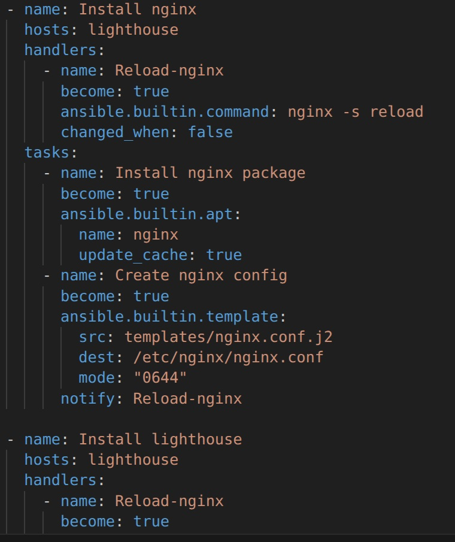
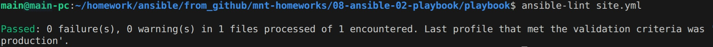
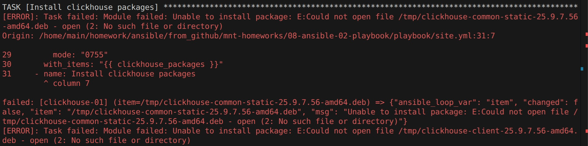
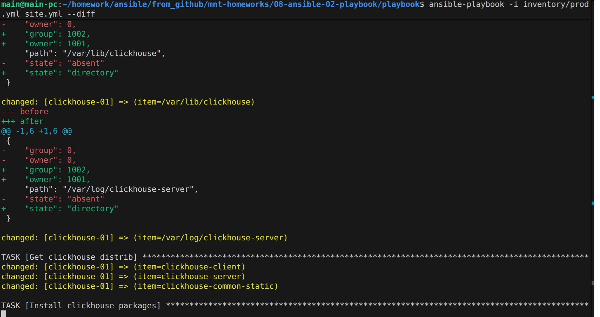
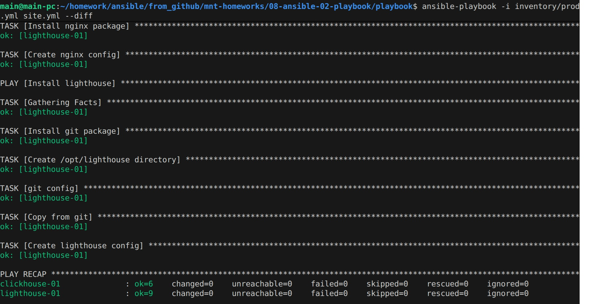

## Решение

Плейбук предназначен для установки Clickhouse и Lighthouse на хосты, указанные в inventory файле.

| Переменная  | Назначение  |
|:---|:---|
| `clickhouse_version` | версия `Clickhouse` |
| `nginx_user_name` | пользователь, из-под которого будет работать `Nginx` |
| `lighthouse_port` | порт для доступа к `Lighthouse` |

1. Добавление ещё один play, который устанавливает и настраивает LightHouse.

2. Запуск `ansible-lint site.yml`.

3. Запуск с флагом `--check`.

4. Запуск с флагом `--diff`.

5. Повторный запуск с флагом `--diff`.
